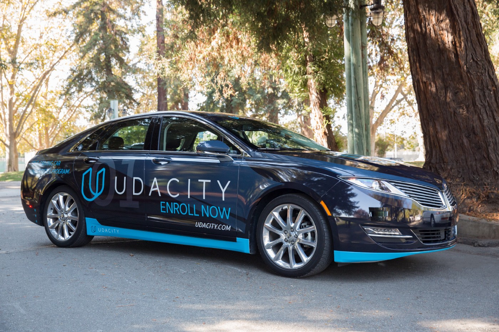
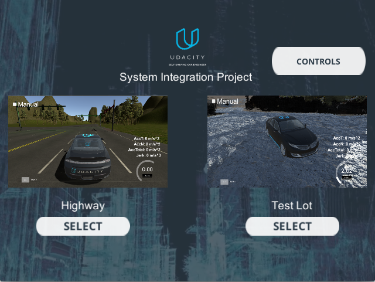
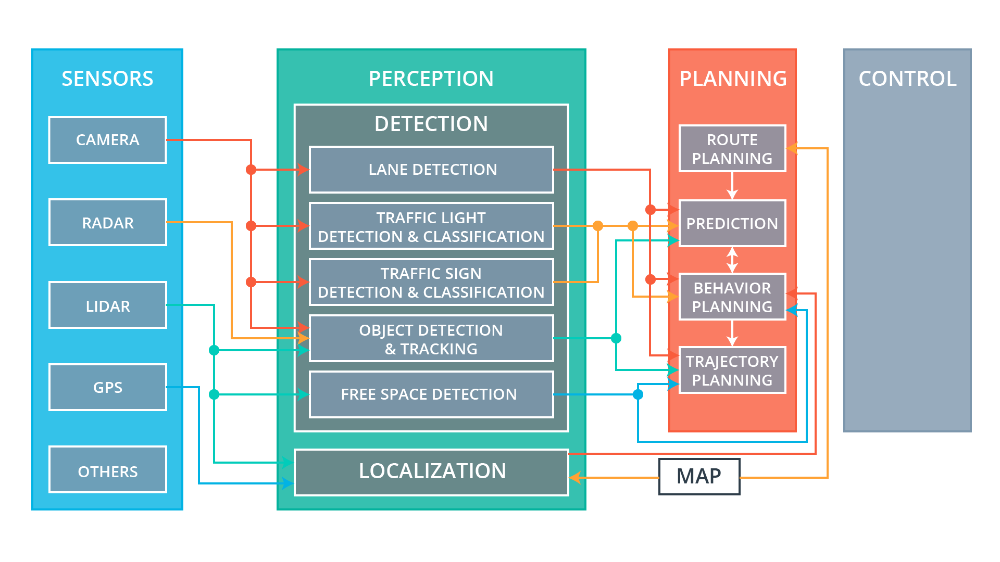

# Team xPace - Udacity Autonomous Car ND Capstone Project 2019

Here is our Autonomous Driving Car Ms Carla



## The Team: xPace (Notes to the reviewer)

| Designations  | Name                     |    Udacity Login E-Mail                        |      GitHub                                     |
| --------- | -------------------------| -------------------------------- | :----------------------------------------------:|
| Team Lead PM | Richard V          |    RichOpenLearning@gmail.com   |      [RichGit101](https://github.com/RichGit101)     |
| Robotics Architect| Sidharth Das|    sidharth2189@gmail.com       |      [sidharth2189](https://github.com/sidharth2189)|
| Technology Architect | Linas Kondrackis           |    linaskondrackis@gmail.com      |      [LinasKo](https://github.com/LinasKo)       |
| Integration Architect   | Sean Iqbal     |    iqbals84@gmail.com     |      [siqb](https://github.com/siqb)    |
| Perception Architect | Kosuke Kuzuoka            |    kousuke.newlife@gmail.com            |      [KKosukeee](https://github.com/KKosukeee)         |


### Essential Read Me

 * Notes for Udacity Reviewer
      Thank you for reviewing xPace Team submission.

      Youtube Video of Testing and Verification
      https://www.youtube.com/watch?v=EZ2Q9PFU_iQ&feature=youtu.be


 * For Installation with Udacity VM environment.
      (For detailed installation, please refer to Installation Instruction section below)


           1. Clone the project repository
           ```bash
           git clone https://github.com/udacity/CarND-Capstone.git
           ```

           2. Install python dependencies
           ```bash
           cd CarND-Capstone
           pip install -r requirements.txt
           pip install matplotlib

           Correct Udacity Workspace terminal_Color.py from GitHub Source of Catlin_tools by copying file.
           This is a Udacity Workspace Bug - https://github.com/catkin/catkin_tools/blob/master/catkin_tools/terminal_color.py


           ```
           3. Make and run styx
           ```bash
           cd ros
           catkin_make
           source devel/setup.sh
           roslaunch launch/styx.launch
         ```
            4. Run the Udacity simulator (or Native Hardware as applicable)
            

 * For Project plans, we used Google Documents to work out plans.


* Architecture In Brief
     On the systems architecture for building Autonomous Functionality, we can divide the architecture into subsystems.

     For this project, We developed ROS nodes to implement core functionality of the autonomous vehicle system, including traffic light detection, control, and waypoint Management. We tested and verified our work on Udacity provided System Integration simulator build on Unity 3D platform. Multiple environments were used during development including VM, udacity workspace and native installs.

          The following is a system architecture diagram showing the ROS nodes and topics used in the project.

          


* Car Systems Specification
        Carla, an autonomous Lincoln MKZ
          

* Car Testing Track
     Udacity  test site in Palo Alto, California.
     

* Car Compute Hardware Specification
      The operating system Carla runs on is Ubuntu Linux.

      Udacity Self-Driving Car Harware Specs:

      31.4 GiB Memory
      Intel Core i7-6700K CPU @ 4 GHz x 8
      TITAN X Graphics
      64-bit OS


* ROS
Robot Operating System (ROS or ros) is robotics middleware (i.e. collection of software frameworks for robot software development). Although ROS is not an operating system, it provides services designed for a heterogeneous computer cluster such as hardware abstraction, low-level device control, implementation of commonly used functionality, message-passing between processes, and package management. Running sets of ROS-based processes are represented in a graph architecture where processing takes place in nodes that may receive, post and multiplex sensor data, control, state, planning, actuator, and other messages.


 

We can quickly look through the way this project is managed with the diagram below




* Waypoint Management

Waypoint Updater Node of ROS is handled in two different phases. First we use Waypoint plotting and start the project once we complete the rest of the sub modules we update the subsystem and make sure we have waypoint management implemented.
We do the initial plotting by developing subscriptions to ROS nodes and handle them through

 /base_waypoints and /current_pose and publish to /final_waypoints.

Waypoint publishing: Once we  identified the traffic lights and determined its position, we  converted it to a waypoint index and published it.
Waypoint Updater is again revisited after traffic lights management submodule. We  used /traffic_waypoint to change the waypoint target velocities before publishing to /final_waypoints. We verified that car  now stops at red traffic lights and move when they are green.

Code for the Work task mentioned is at
(path_to_project_repo)/ros/src/waypoint_updater/

This package contains the waypoint updater node: waypoint_updater.py. The purpose of this node is to update the target velocity property of each waypoint based on traffic light and obstacle detection data. This node will subscribe to the /base_waypoints, /current_pose, /obstacle_waypoint, and /traffic_waypoint topics, and publish a list of waypoints ahead of the car with target velocities to the /final_waypoints topic.

        


* Drive By Wire Management

Carla is equipped with a drive-by-wire (dbw) system,  the throttle, brake, and steering have electronic control.
This package contains the files that are responsible for control of the vehicle: the node dbw_node.py and the file twist_controller.py, along with a pid and lowpass filter that we used in our implementation. The dbw_node subscribes to the /current_velocity topic along with the /twist_cmd topic to receive target linear and angular velocities. Additionally, this node subscribes to /vehicle/dbw_enabled, which indicates if the car is under dbw or driver control. This node publishes throttle, brake, and steering commands to the /vehicle/throttle_cmd, /vehicle/brake_cmd, and /vehicle/steering_cmd topics.


DBW Node: Once your waypoint updater is publishing /final_waypoints, the waypoint_follower node  starts publishing messages to the/twist_cmd topic. At this point, We have everything needed to build the dbw_node. After completing this step, the car can be verified that it could be driven in the simulator, ignoring the traffic lights.


Twist controller package files
Within the twist controller package, we  will find the following:

dbw_node.py
This python file implements the dbw_node publishers and subscribers. We wrote ROS subscribers for the /current_velocity, /twist_cmd, and /vehicle/dbw_enabled topics. This file also imports the Controller class from twist_controller.py which was   used for implementing the necessary controllers. The function used to publish throttle, brake, and steering is publish.

Note that throttle values passed to publish should be in the range 0 to 1, although a throttle of 1 means the vehicle throttle will be fully engaged. Brake values passed to publish should be in units of torque (N*m). The correct values for brake can be computed using the desired acceleration, weight of the vehicle, and wheel radius.
twist_controller.py
This file contains a stub of the Controller class. We used this class to implement vehicle control. The control method can take twist data as input and return throttle, brake, and steering values. Within this class, we  can import and use the provided pid.py and lowpass.py if needed for acceleration, and yaw_controller.py for steering.

yaw_controller.py
Controller that is  used to convert target linear and angular velocity to steering commands.
pid.py
A generic PID controller that is used in twist_controller.py.
lowpass.py
A generic low pass filter that can is used in twist_controller.py.
dbw_test.py
We used this file to test your DBW code against a bag recorded with a reference implementation. The bag can be found at https://s3-us-west-1.amazonaws.com/udacity-selfdrivingcar/files/reference.bag.zip

dbw_node.py is currently set up to publish steering, throttle, and brake commands at 50hz.

The DBW system on Carla expects messages at this frequency, and will disengage (reverting control back to the driver) if control messages are published at less than 10hz. This is a safety feature on the car intended to return control to the driver if the software system crashes.


Although the simulator displays speed in mph, all units in the project code use the metric system, including the units of messages in the /current_velocity topic (which have linear velocity in m/s).

Finally, Carla has an automatic transmission, which means the car will roll forward if no brake and no throttle is applied. To prevent Carla from moving requires about 700 Nm of torque.


* Object Detection


Traffic Light Detection submodule : This can be split into 2 parts:
Detection: Detect the traffic light and its color from the /image_color.

The topic /vehicle/traffic_lights contains the exact location and status of all traffic lights in simulator. We used it for test verification or cross-checking.


(path_to_project_repo)/ros/src/tl_detector/

This package contains the traffic light detection node: tl_detector.py. This node takes in data from the /image_color, /current_pose, and /base_waypoints topics and publishes the locations to stop for red traffic lights to the /traffic_waypoint topic.

The /current_pose topic provides the vehicle's current position, and /base_waypoints provides a complete list of waypoints the car will be following.

We built both a traffic light detection node and a traffic light classification node. Traffic light detection  takes place within tl_detector.py, whereas traffic light classification  takes place within ../tl_detector/light_classification_model/tl_classfier.py.

Traffic Light Detection package files
Within the traffic light detection package, we will find the following:

tl_detector.py
This python file processes the incoming traffic light data and camera images. It uses the light classifier to get a color prediction, and publishes the location of any upcoming red lights.
tl_classifier.py
This file contains the TLClassifier class. We  used this class to implement traffic light classification. The get_classification method takes a camera image as input and return an ID corresponding to the color state of the traffic light in the image. Miss Carla currently has TensorFlow 1.3.0 installed.


traffic_light_config
This config file contains information about the camera (such as focal length) and the 2D position of the traffic lights's stop line in world coordinates.


## Introduction

    This is the project repo for the final project of the Udacity Self-Driving Car Nanodegree: Programming a Real Self-Driving Car. For more information about the project, see the project introduction [here](https://classroom.udacity.com/nanodegrees/nd013/parts/6047fe34-d93c-4f50-8336-b70ef10cb4b2/modules/e1a23b06-329a-4684-a717-ad476f0d8dff/lessons/462c933d-9f24-42d3-8bdc-a08a5fc866e4/concepts/5ab4b122-83e6-436d-850f-9f4d26627fd9).


Please use **one** of the two installation options, either native **or** docker installation.

### Native Installation

* Be sure that your workstation is running Ubuntu 16.04 Xenial Xerus or Ubuntu 14.04 Trusty Tahir. [Ubuntu downloads can be found here](https://www.ubuntu.com/download/desktop).
* If using a Virtual Machine to install Ubuntu, use the following configuration as minimum:
  * 2 CPU
  * 2 GB system memory
  * 25 GB of free hard drive space

  The Udacity provided virtual machine has ROS and Dataspeed DBW already installed, so you can skip the next two steps if you are using this.

* Follow these instructions to install ROS
  * [ROS Kinetic](http://wiki.ros.org/kinetic/Installation/Ubuntu) if you have Ubuntu 16.04.
  * [ROS Indigo](http://wiki.ros.org/indigo/Installation/Ubuntu) if you have Ubuntu 14.04.
* [Dataspeed DBW](https://bitbucket.org/DataspeedInc/dbw_mkz_ros)
  * Use this option to install the SDK on a workstation that already has ROS installed: [One Line SDK Install (binary)](https://bitbucket.org/DataspeedInc/dbw_mkz_ros/src/81e63fcc335d7b64139d7482017d6a97b405e250/ROS_SETUP.md?fileviewer=file-view-default)
* Download the [Udacity Simulator](https://github.com/udacity/CarND-Capstone/releases).


### Docker Installation
[Install Docker](https://docs.docker.com/engine/installation/)

Build the docker container
```bash
docker build . -t capstone
```

Run the docker file
```bash
docker run -p 4567:4567 -v $PWD:/capstone -v /tmp/log:/root/.ros/ --rm -it capstone
```

### Port Forwarding
To set up port forwarding, please refer to the [instructions from term 2](https://classroom.udacity.com/nanodegrees/nd013/parts/40f38239-66b6-46ec-ae68-03afd8a601c8/modules/0949fca6-b379-42af-a919-ee50aa304e6a/lessons/f758c44c-5e40-4e01-93b5-1a82aa4e044f/concepts/16cf4a78-4fc7-49e1-8621-3450ca938b77)

### Installation Instructions

1. Clone the project repository
```bash
git clone https://github.com/udacity/CarND-Capstone.git
```

2. Install python dependencies
```bash
cd CarND-Capstone
pip install -r requirements.txt
pip install matplotlib

Correct Udacity Workspace terminal_Color.py from GitHub Source of Catlin_tools by copying file.
This is a Udacity Workspace Bug - https://github.com/catkin/catkin_tools/blob/master/catkin_tools/terminal_color.py


```
3. Make and run styx
```bash
cd ros
catkin_make
source devel/setup.sh
roslaunch launch/styx.launch
```
4. Run the simulator

### Real world testing
1. Download [training bag](https://s3-us-west-1.amazonaws.com/udacity-selfdrivingcar/traffic_light_bag_file.zip) that was recorded on the Udacity self-driving car.
2. Unzip the file
```bash
unzip traffic_light_bag_file.zip
```
3. Play the bag file
```bash
rosbag play -l traffic_light_bag_file/traffic_light_training.bag
```
4. Launch your project in site mode
```bash
cd CarND-Capstone/ros
roslaunch launch/site.launch
```
5. We Confirmed it. Traffic light detection works on real life images


### Team Project Plan

[ProjectPlan](https://docs.google.com/spreadsheets/d/1yXDmX8VkRF4R1uFpLf4eosONtoQGhlpvyE3rIhGkhIw/edit?usp=drive_open&ouid=0)

[ProgressReport](https://docs.google.com/spreadsheets/d/1yXDmX8VkRF4R1uFpLf4eosONtoQGhlpvyE3rIhGkhIw/edit?usp=drive_open&ouid=0)


#### Team Shared Area

[GoogleDrive](https://drive.google.com/drive/folders/12-OgSGg3DqfWhmPE_lWJkIk2IxPkl_jM)

#### Team Collaboration

[xPace_Team_Slack](https://xPaceUdacityCapstone.slack.com)

#### Team SCMF

[Team_xPace_Git](https://github.com/RichGit101/xPace_team/edit/master/README.md)

#### Team Project Documentation

[Team_xPace_Project_Documentation](https://drive.google.com/drive/folders/1T-12yLj-_NfmBouQKXBK3eX_UQgRaxJd?usp=sharing)

#### xPace Project Demonstration

[Team_xPace_Project_Demo](https://drive.google.com/drive/folders/1a9IHUFllxRHKIZx4J7LWxIYQd2k1cTsx)

#### xPace Project Test and Safety report

[Verification](https://drive.google.com/drive/folders/1WJEgrnbgu9aSMsXbmWnaCZ-HcJzWg1xa)

[Safety](https://drive.google.com/drive/folders/1XA0LDGLaKKo0rhIgDFfnr9bDELPaUpDO)

#### xPace Planned Enhancements

[Team_xPace_Kaizen_Enhancements](https://drive.google.com/drive/folders/1tay3dr-yKMdMzBEvEtzd6e06AZNQVQtD)

#### xPace Known Issues and Bugs

[Team_xPace_Known_Bugs_Report](https://drive.google.com/drive/folders/1f1nXcUWi1Mf-WWFqh8-Vg9LJgh1jBq98)

### xPace Software Architecture and Quality Control

Planned. WIP.
Architecture Framework, Standards and road map

### xPace Car Platform Architecture and Quality Control

Planned. Kaizen. Design of mechanical and mechatronics, systems engineering  WIP


### xPace Car Product Strategy

Planned


### xPace Visual Perception Lab

[xPace_Perception_Lab](https://github.com/RichGit101/xPace_ObjDetection.git)


### xPace Thanks and References for Data analysis
  Thanks to all our references. We fully acknowledge and appreciate all the references and the help we obtained from references, mentors, instructors, class friends and online.
  Links to references.
